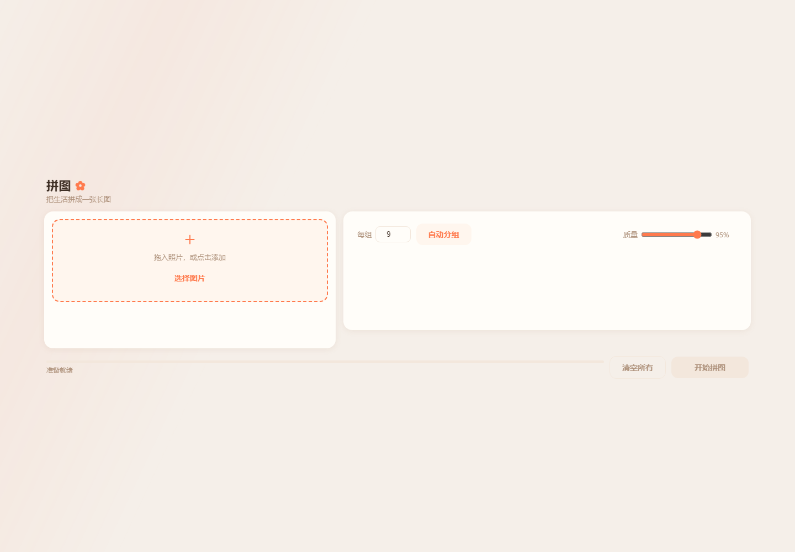
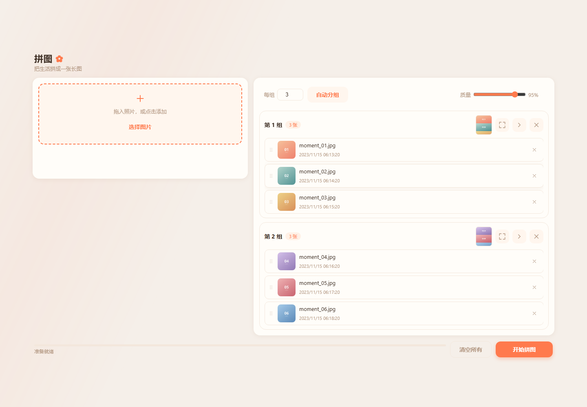
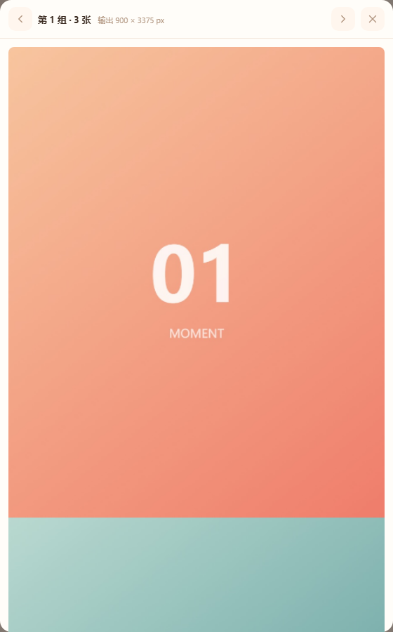
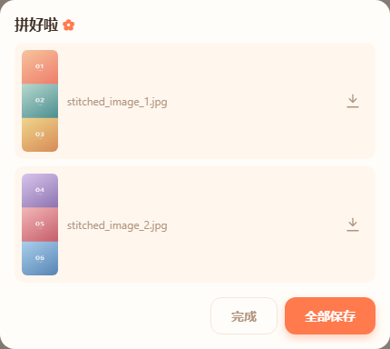

# MomentWebStitcher

网页版朋友圈长图拼接工具：把多张照片按分组垂直拼接成适合社交分享的长图。项目采用纯前端实现，图片处理在浏览器本地完成，图片数据不会上传服务器。

[](LICENSE)
[](https://developer.mozilla.org/docs/Web/API/Canvas_API)
[](https://piggywu981.github.io/MomentWebStitcher/)

**在线使用：** <https://piggywu981.github.io/MomentWebStitcher/>



## 功能特性

- **批量上传：** 支持点击选择或拖拽添加多张图片。
- **自动分组：** 自定义每组图片数量，一键生成多个分组；默认值为 9 张。
- **拍摄时间排序：** 优先读取 EXIF 拍摄时间，按早到晚排序；没有拍摄时间时使用文件修改时间，并排在有 EXIF 时间的图片之后。
- **拖拽整理：** 图片可以在图片池和分组之间移动，也可以在组内拖拽调整顺序，按照落点插入。
- **触屏操作：** 手机和平板支持长按拖拽、震动反馈和防误触阈值。
- **实时预览：** 分组卡片显示迷你长图预览，可打开全屏预览查看输出尺寸。
- **批量保存：** 拼接完成后，在结果卡片中单张保存或全部保存。
- **本地处理：** 使用 Canvas API 完成拼接和压缩，运行时不需要后端服务。

## 快速开始

### 在线使用

打开 <https://piggywu981.github.io/MomentWebStitcher/>，无需安装即可使用。

### 本地运行

项目是无需构建的静态网站，使用任意静态文件服务器即可启动：

```bash
git clone https://github.com/Piggywu981/MomentWebStitcher.git
cd MomentWebStitcher
npm run dev
```

然后访问 <http://localhost:8000>。

也可以直接运行：

```bash
python -m http.server 8000
```

部分浏览器支持直接双击 `index.html` 打开，但使用静态服务器更稳定。

## 使用流程

### 1. 上传照片

将照片拖入图片池，或点击「选择图片」批量添加。上传后，应用会读取可用的 EXIF 拍摄时间并完成排序。

### 2. 分组整理

在右侧设置每组图片数量，点击「自动分组」。需要更细致的调整时，可以：

- 将图片从图片池拖到指定分组；
- 在分组之间移动图片；
- 在同一分组内拖拽调整顺序；
- 使用分组右侧的清空按钮，把该组移除；
- 使用展开按钮查看该组的长图预览。



### 3. 预览拼接结果

点击分组卡片上的预览按钮，打开全屏预览浮层。预览头部会显示当前分组、图片数量和输出尺寸。



### 4. 保存结果

点击底部「开始拼图」按钮，应用会逐组处理可拼接的分组并显示进度。处理完成后，结果卡片会列出生成的 JPG 文件，可以单张保存，也可以点击「全部保存」。



## 触屏手势

| 操作 | 说明 |
| --- | --- |
| 长按约 400 ms 后移动 | 开始拖拽图片 |
| 拖到目标分组后松手 | 按落点位置插入图片 |
| 在同组内拖动 | 调整图片顺序 |
| 拖回图片池 | 将图片从分组移回待分组区域 |
| 点击缩略图上的关闭按钮 | 删除图片 |
| 轻微移动后松手 | 不触发拖拽，避免误操作 |

## 输出规则

- **拼接方向：** 当前版本只支持垂直拼接。
- **质量范围：** 输出质量可设置为 70%～100%，默认值为 95%。
- **输出宽度：** 取分组内最小原图宽度，并限制在 1080 px 以内；超过限制时等比缩小。
- **画布面积：** 总面积上限为 16,777,216 px²，用于降低移动端 Safari 生成空白长图的概率。
- **输出文件：** 每个包含至少 2 张图片的分组生成一个 JPG 文件；只有 1 张图片的分组会被跳过并提示。

## 支持格式与兼容性

### 图片格式

常见的 JPEG / JPG、PNG、WebP、GIF 和 BMP 图片通常可以直接处理。实际支持范围取决于浏览器的图片解码能力。

浏览器无法解码的格式（例如部分 iPhone HEIC 原图）会被跳过并提示。遇到这种情况，请先转换为 JPG 或 PNG。

### 浏览器

- Chrome 90+
- Firefox 88+
- Safari 14+
- Edge 90+

## 技术实现


- **页面：** HTML5、CSS3、原生 JavaScript（ES6+）。
- **图片处理：** Canvas API，负责缩放、垂直拼接和 JPEG 压缩。
- **文件排序：** `exif-js` 读取 EXIF 时间；脚本通过 cdnjs 加载该依赖，并配置了 SRI 完整性校验。
- **交互：** 原生 Drag & Drop API、Touch Events API 和 Vibration API。
- **响应式布局：** CSS Grid、Flexbox 和媒体查询适配桌面、手机与平板。
- **部署：** GitHub Actions 自动发布到 GitHub Pages。

## 项目结构

```text
MomentWebStitcher/
├── index.html                     # 主页面与浮层结构
├── style.css                      # 主题、响应式布局和交互样式
├── script.js                      # 上传、分组、预览、拼接与保存逻辑
├── tests/
│   ├── smoke.test.js              # Playwright 冒烟测试
│   └── smoke-after.png            # 测试运行后的截图产物
├── docs/
│   ├── images/                    # README 配图
│   └── superpowers/               # 设计与实现记录
├── .github/workflows/deploy.yml   # GitHub Pages 部署工作流
├── package.json
└── LICENSE
```

## 开发与测试

运行冒烟测试前，安装开发依赖和 Chromium：

```bash
npm install -D playwright
npx playwright install chromium
npm test
```

测试覆盖上传、EXIF 排序、无法解码格式处理、鼠标拖拽、触屏手势、迷你预览、全屏预览和结果卡片等主流程。Playwright 仅用于本地测试，不影响线上版本的零后端运行方式。

## 部署

推送到 `main` 分支后，GitHub Actions 会根据 `.github/workflows/deploy.yml` 发布静态文件。首次启用 GitHub Pages 时，请在仓库的 Settings → Pages 中确认发布来源为工作流或 `gh-pages` 分支，具体以仓库当前配置为准。

## 常见问题

### 图片会上传到服务器吗？

不会。图片读取、排序、拼接和压缩都在当前浏览器页面中完成。项目只会从 cdnjs 加载 `exif-js` 脚本，不会上传照片内容。

### 为什么处理速度较慢？

拼接工作由浏览器完成，大尺寸原图会占用更多内存和 CPU。建议减少单次处理的图片数量、使用合理大小的原图，并关闭其他占用资源的标签页。

### 有文件大小限制吗？

项目没有额外设置单文件大小限制，但浏览器和设备的内存会限制实际可处理规模。建议单张图片不超过 10 MB，单次处理不超过 50 张。

### 如何调整照片顺序？

在分组内拖拽即可调整顺序，也可以把图片拖回图片池后重新分组。

### 可以横向拼接吗？

当前版本只支持垂直拼接。

## 贡献

欢迎通过 [GitHub Issues](https://github.com/Piggywu981/MomentWebStitcher/issues) 提交问题或建议，也欢迎提交 Pull Request。

## 许可证

本项目采用 [MIT License](LICENSE)。
